# MERCURY X

## Autonomous AI Compute & Inference Fabric

MERCURY X is an experimental, research-oriented AI compute control fabric designed to reason about how AI workloads should execute across heterogeneous infrastructure while preserving quality, service-level objectives (SLOs), safety, privacy, authorization, and human control.

The repository implements a CPU-first control plane: typed contracts, deterministic decision engines, validation layers, provenance records, failure handling, and executable certification gates. It does not claim to be a deployed autonomous datacenter or a production GPU runtime.

## Why MERCURY X Exists

Modern AI execution is more than choosing a model. A control plane must reconcile heterogeneous accelerators, model and precision compatibility, graph structure, context and KV state, reasoning cost, placement, speculation, migration, failures, privacy and residency rules, edge/cloud federation, and scheduling policy changes. Those inputs can be incomplete, stale, or contradictory.

MERCURY X decomposes this problem into independently validated phases. Each phase consumes explicit evidence, emits immutable or versioned artifacts where appropriate, and preserves enough provenance for downstream decisions to be checked.

## Core Principle

MERCURY X must never satisfy compute pressure by silently weakening:

- quality;
- safety or verification;
- authorization;
- privacy or residency;
- an agreed SLO.

Unknown, stale, unauthorized, or contradictory state is rejected, deferred, or represented explicitly. It is not converted into implicit approval.

## System Lifecycle

```text
Sense
  -> Understand Workload
  -> Build Execution Graph
  -> Select Model/Precision
  -> Place Compute
  -> Execute
  -> Observe
  -> Negotiate
  -> Migrate/Heal
  -> Challenge
  -> Simulate
  -> Learn Safely
  -> Govern
  -> Verify
```

## 30-Phase Architecture

MERCURY X has 31 numbered phases, Phase 0 through Phase 30, grouped into nine layers.

### Foundation & Workload Intelligence — Phases 0–3

- **Phase 0:** Runtime Contract and Observability Foundation
- **Phase 1:** Cognitive Gateway
- **Phase 2:** Workload Intelligence Engine
- **Phase 3:** AI Execution Graph

### Model & Execution Adaptation — Phases 4–7

- **Phase 4:** Model Capability Fabric
- **Phase 5:** Dynamic Model Composition
- **Phase 6:** Adaptive Precision
- **Phase 7:** Elastic Model Morphing

### Memory & Context Fabric — Phases 8–12

- **Phase 8:** Agent Session Memory Fabric
- **Phase 9:** Global Context Memory
- **Phase 10:** Context Prediction Engine
- **Phase 11:** Semantic KV Cache
- **Phase 12:** Disaggregated Cognitive Execution

### Hardware & Placement Intelligence — Phases 13–16

- **Phase 13:** Hardware Personality Engine
- **Phase 14:** Topology-Aware Compute
- **Phase 15:** Predictive Compute Placement
- **Phase 16:** Speculative Execution Mesh

### Reasoning, SLO & Negotiation — Phases 17–20

- **Phase 17:** Adaptive Reasoning Budget v2
- **Phase 18:** Quality-Aware Scheduling v2
- **Phase 19:** Intelligence Contract Compiler v2
- **Phase 20:** Autonomous Compute Negotiator v2

### Migration & Resilience — Phases 21–22

- **Phase 21:** Live AI Workload Migration
- **Phase 22:** Self-Healing AI Infrastructure

### Scheduler Intelligence — Phases 23–25

- **Phase 23:** Adversarial Scheduler
- **Phase 24:** Counterfactual Compute
- **Phase 25:** Controlled Policy Evolution

### Federation & Privacy — Phases 26–27

- **Phase 26:** Federated Execution
- **Phase 27:** Privacy-Aware Execution

### Simulation & Supervisory Intelligence — Phases 28–29

- **Phase 28:** Datacenter Digital Twin
- **Phase 29:** Control Intelligence

### Platform — Phase 30

- **Phase 30:** Production/Research Platform

The complete input/output and safety-boundary index is in [PHASE_INDEX.md](docs/architecture/PHASE_INDEX.md).

## Architecture Overview

```mermaid
flowchart LR
    A[Gateway & workload intelligence<br/>Phases 0–3] --> B[Model adaptation<br/>Phases 4–7]
    B --> C[Memory & context<br/>Phases 8–12]
    C --> D[Hardware, topology & placement<br/>Phases 13–16]
    D --> E[Reasoning, scheduling, SLO & negotiation<br/>Phases 17–20]
    E --> F[Migration & healing<br/>Phases 21–22]
    F --> G[Challenge, simulation & policy evolution<br/>Phases 23–25]
    G --> H[Federation & privacy<br/>Phases 26–27]
    H --> I[Digital twin & control intelligence<br/>Phases 28–29]
    I --> J[Production/research platform<br/>Phase 30]
    J -. telemetry, evidence and governance .-> A
```



See [MERCURY_X_ARCHITECTURE.md](docs/architecture/MERCURY_X_ARCHITECTURE.md) for the detailed architecture and runtime boundaries.

## Architecture Diagrams

- [System overview](docs/architecture/diagrams/SYSTEM_OVERVIEW.md) — the flagship logical control-plane view
- [Phase architecture](docs/architecture/diagrams/PHASE_ARCHITECTURE.md) — all phases from 0 through 30
- [Execution lifecycle](docs/architecture/diagrams/EXECUTION_LIFECYCLE.md) — normal and fail-closed decision paths
- [Safety control plane](docs/architecture/diagrams/SAFETY_CONTROL_PLANE.md) — hard invariant gates around action
- [Migration and recovery](docs/architecture/diagrams/MIGRATION_AND_RECOVERY.md) — Phase 21–22 cutover, rollback, and healing

## Important Safety Invariants

- Unknown, incomplete, contradictory, or stale evidence fails closed.
- Generation-aware artifacts prevent decisions from silently using obsolete state.
- Provenance links decisions to their inputs and evidence.
- Immutable and fingerprinted artifacts make supported control decisions tamper-evident.
- Quality, verification, safety, privacy, authorization, and residency constraints cannot be silently relaxed.
- Policy promotion requires evidence, controlled lifecycle transitions, and explicit human approval.
- Counterfactual and digital-twin outputs are advisory; simulation is not production execution.
- Research mode cannot weaken production safety guarantees.
- Migration cutover preserves exactly one authoritative executor.

The normative summary is in [SAFETY_INVARIANTS.md](docs/architecture/SAFETY_INVARIANTS.md).

## Repository Structure

```text
configs/
  certification/        Per-phase executable gate manifests
  artifacts/            Versioned control-plane artifacts
  benchmarks/           Benchmark configuration
  hardware/             Hardware descriptions
  policies/             Policy configuration
  registries/           Capability/registry data
  slo/                  SLO configuration
docs/
  architecture/         Product-level architecture and safety documentation
  superpowers/specs/    Phase design specifications
  superpowers/plans/    Phase implementation plans
src/mercury/
  gateway, intelligence, graph/
                        Workload ingestion and logical planning
  models, composition, precision, morphing/
                        Model capability and adaptation
  session_memory, global_memory, context_prediction,
  semantic_kv_cache, disaggregated_execution/
                        Memory and context systems
  hardware_personality, topology, placement, speculation/
                        Hardware and placement intelligence
  reasoning_budget, quality_scheduler, intelligence_slo,
  compute_negotiator/   Reasoning and negotiation control
  live_migration, self_healing/
                        Resilience control planes
  adversarial_scheduler, counterfactual_compute,
  policy_evolution/     Challenge, simulation, and governed evolution
  federated_execution, privacy_execution/
                        Federation and privacy boundaries
  datacenter_twin, control_intelligence, platform/
                        Simulation, supervision, and platform modes
  certification/       Executable internal certification evaluators
tests/                  Focused, integration, adversarial, and certification tests
```

## Installation

The repository targets Windows, PowerShell, and Python 3.13. The pinned dependency set is in `requirements.txt`.

```powershell
py -3.13 -m venv .venv
.\.venv\Scripts\python.exe -m pip install -r requirements.txt
.\.venv\Scripts\python.exe -m pip install --no-deps --no-build-isolation -e .
.\.venv\Scripts\python.exe -c "import mercury; print(mercury.__file__)"
```

Do not place credentials in the repository. `.env.example` documents the available environment-variable shape.

## Running Tests

Run a focused test while developing:

```powershell
.\.venv\Scripts\python.exe -m pytest tests/test_phase30_platform.py -q
```

Run the complete suite with isolated Windows-safe temporary and cache directories:

```powershell
$stamp = Get-Date -Format "yyyyMMddHHmmss"
$bt = Join-Path $env:TEMP "mercury-pytest-$stamp"
$cache = Join-Path $env:TEMP "mercury-cache-$stamp"
.\.venv\Scripts\python.exe -m pytest tests -q --basetemp="$bt" -o cache_dir="$cache"
```

## Certification

Each phase has an internal executable certification manifest under `configs/certification/` and an evaluator under `src/mercury/certification/`. These are architecture/completeness gates for this repository—not external, regulatory, security, or industry certifications.

Examples:

```powershell
.\.venv\Scripts\python.exe -m mercury.certification.phase21
.\.venv\Scripts\python.exe -m mercury.certification.phase22
# ...
.\.venv\Scripts\python.exe -m mercury.certification.phase30
```

Certification checks complement tests; they do not replace empirical validation on real infrastructure.

## Demonstration Modes

The repository supports CPU-local demonstrations of its control-plane contracts and deterministic engines: workload analysis, graph construction, candidate generation, validation, scheduling decisions, negotiation, migration state transitions, simulation, governance, and certification.

Accelerator execution, distributed deployment, real cloud resources, hardware-backed privacy, and live multi-datacenter operations require adapters and infrastructure outside the certified local baseline. Interfaces and simulations for these concerns must not be presented as measured production behavior.

## Current Validation State

- Phases 0–30 have implementation and executable certification coverage in this repository.
- The repository reached **1506 passing tests** during final Phase 26–30 validation.
- The current documentation change does not claim a fresh test run or a production deployment.

See [VALIDATION.md](docs/VALIDATION.md) for evidence categories and verification practice.

## Limitations

MERCURY X currently makes no claim of:

- autonomous operation of a real datacenter;
- production-grade live GPU-memory migration;
- an empirically calibrated datacenter digital twin unless backed by separately recorded measurements;
- a trained autonomous scheduler unless a concrete trained artifact and evaluation evidence are present;
- production-scale multi-datacenter federation;
- hardware-backed privacy enforcement;
- measured hyperscale cost, latency, quality, power, or thermal performance.

Some distributed, cloud, and hardware capabilities remain interface or simulation boundaries. MERCURY X is research and engineering portfolio software. See [LIMITATIONS.md](docs/LIMITATIONS.md).

## Roadmap Status

Phases 0–30 are complete. Future work is productization rather than another numbered phase: empirical benchmarking, real infrastructure integrations, operational UI, reproducible experiments, and deployment evaluation.

## Engineering Principles

- CPU-first control plane
- typed and versioned contracts
- test-driven development
- deterministic behavior where possible
- fail-closed decisions
- explicit human control
- reproducibility
- explicit uncertainty
- end-to-end provenance
