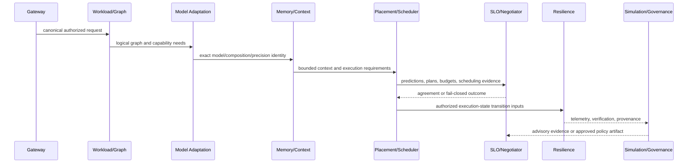

# MERCURY X Architecture

## 1. System Purpose

MERCURY X is an experimental AI compute control fabric. It transforms an authorized request into a chain of typed, evidence-backed control artifacts: workload intelligence, a logical execution graph, model and precision candidates, memory/context state, placement predictions, scheduling and SLO decisions, compute agreements, resilience plans, simulations, and governed platform decisions.

The architecture is primarily a control plane. A phase may describe, validate, predict, negotiate, or simulate an action without owning the physical action itself. This distinction is deliberate: logical decisions remain inspectable and testable even when real hardware, distributed transports, or production operators are absent.

## 2. Architectural Principles

1. **Quality and hard constraints are monotonic.** Downstream phases may preserve or strengthen them, not silently weaken them.
2. **Fail closed.** Unknown, stale, malformed, contradictory, or unauthorized state cannot become approval.
3. **Typed boundaries.** Phase handoffs use explicit contracts rather than raw prompts or unvalidated dictionaries.
4. **Generation awareness.** Mutable world state is referenced by generation so stale decisions can be rejected.
5. **Provenance and identity.** Logical artifacts retain source identities, versions, evidence, and deterministic fingerprints where implemented.
6. **Bounded generation.** Candidate/profile/branch generation has explicit limits and deterministic ordering.
7. **Human control.** Negotiated changes and policy promotion require explicit authority; silence is not consent.
8. **Simulation isolation.** Counterfactual and twin results remain advisory.
9. **CPU-first development.** Control logic runs locally without requiring accelerators.

### Diagram Navigation

- [System overview](diagrams/SYSTEM_OVERVIEW.md)
- [Phase 0–30 architecture](diagrams/PHASE_ARCHITECTURE.md)
- [Execution lifecycle](diagrams/EXECUTION_LIFECYCLE.md)
- [Safety control plane](diagrams/SAFETY_CONTROL_PLANE.md)
- [Migration and recovery](diagrams/MIGRATION_AND_RECOVERY.md)

## 3. Layered Architecture

```mermaid
flowchart TB
    subgraph F[Foundation and Workload Intelligence]
      P0[0 Runtime foundation] --> P1[1 Cognitive gateway] --> P2[2 Workload intelligence] --> P3[3 Execution graph]
    end
    subgraph M[Model and Execution Adaptation]
      P4[4 Capability fabric] --> P5[5 Composition] --> P6[6 Precision] --> P7[7 Morphing]
    end
    subgraph C[Memory and Context]
      P8[8 Session memory] --> P9[9 Global context] --> P10[10 Prediction] --> P11[11 Semantic KV] --> P12[12 Disaggregated execution]
    end
    subgraph H[Hardware and Placement]
      P13[13 Hardware personality] --> P14[14 Topology] --> P15[15 Placement] --> P16[16 Speculation]
    end
    subgraph N[Reasoning, SLO and Negotiation]
      P17[17 Reasoning budget] --> P18[18 Scheduling] --> P19[19 SLO compiler] --> P20[20 Negotiator]
    end
    subgraph R[Resilience and Supervisory Control]
      P21[21 Migration] --> P22[22 Healing] --> P23[23 Adversarial scheduler] --> P24[24 Counterfactual compute] --> P25[25 Policy evolution]
    end
    subgraph X[Federation, Simulation and Platform]
      P26[26 Federation] --> P27[27 Privacy] --> P28[28 Digital twin] --> P29[29 Control intelligence] --> P30[30 Platform]
    end
    P3 --> P4
    P7 --> P8
    P12 --> P13
    P16 --> P17
    P20 --> P21
    P25 --> P26
```

This diagram shows the primary conceptual flow. Individual engines also consume upstream provenance and evidence across layer boundaries.

## 4. Detailed Phase 0–30 Map

| Layer | Phases | Implemented responsibility |
|---|---|---|
| Foundation | 0–3 | Runtime evidence foundation, canonical gateway, workload analysis, logical DAG |
| Model adaptation | 4–7 | Capability registry/discovery, certified composition, precision, morph profiles |
| Context | 8–12 | Session/global memory, context prediction, semantic KV reuse, disaggregated plans |
| Hardware intelligence | 13–16 | Hardware personality, topology, predictive placement, bounded speculation |
| Decision control | 17–20 | Reasoning budgets, quality-aware scheduling, SLO compilation, compute negotiation |
| Resilience | 21–22 | Verified migration and self-healing lifecycles |
| Scheduler intelligence | 23–25 | Adversarial challenges, counterfactual simulation, controlled policy evolution |
| Federation/privacy | 26–27 | Explicit federation domains and privacy envelopes |
| Supervisory platform | 28–30 | Datacenter twin, control intelligence, production/research modes |

See [PHASE_INDEX.md](PHASE_INDEX.md) for every phase’s inputs, outputs, and safety boundary.

## 5. Core Control Flow

There is no universal “magic object.” Each boundary preserves the identities and versions needed for the next phase to validate its assumptions.

## 6. Data and Control Contracts

Contracts are predominantly immutable Pydantic models. Depending on the phase, they enforce nonblank identities, canonical collection ordering, exact enum vocabularies, schema/version fields, generation bounds, source-artifact lineage, and content-addressed fingerprints. Candidate-producing phases retain rejected alternatives and deterministic reasons rather than silently dropping unsafe states.

Configuration under `configs/` supplies certification manifests, policies, registries, hardware descriptions, SLO data, artifacts, and benchmark definitions. Configuration is an input to validation—not an authority to bypass contract checks.

## 7. Model Adaptation

Phases 4–7 separate four questions:

- What capabilities does an exact model identity and revision declare?
- Which certified multi-model topology can satisfy the logical requirements?
- Which registered precision profiles are compatible?
- Which registered morph variants are compatible with the exact lineage and precision?

Generation is deterministic and bounded. Canonical order is reproducibility order, not preference. These phases do not rank winners, bind graph nodes to physical devices, or invoke models.

## 8. Memory and Context

Phase 8 isolates turn/task/session memory and controls admission, retrieval, compaction, expiry, and closure. Phase 9 permits explicit promotion into tenant, workspace, or project namespaces only with matching authorization. Phases 10–11 predict context requirements and validate semantic KV reuse without granting cross-boundary access. Phase 12 expresses disaggregated cognitive stages while preserving source context and provenance.

Global user-profile memory and implicit cross-session/cross-namespace access are outside the certified baseline.

## 9. Placement and Topology

Phase 13 creates evidence-backed hardware personality profiles. Phase 14 represents topology and path constraints. Phase 15 emits predictions with backend identity, uncertainty, calibration state, and upstream generations. Phase 16 plans a bounded speculative mesh and requires verification before committing one authoritative result.

Predictions are not reservations. Topology is not a scheduler. Speculation does not authorize duplicate commits.

## 10. Reasoning, SLO, and Negotiation

Phase 17 accounts for primary reasoning, verification, speculation, escalation, retries, and aggregation under explicit quality and confidence floors. Phase 18 performs typed admission and scheduling with fairness and resource evidence. Phase 19 compiles requirements through a metric registry, policy hierarchy, temporal targets, and protected error budgets into a fingerprinted SLO. Phase 20 evaluates feasibility and can issue leased offers.

Phase 20 is a negotiation boundary, not a scheduler, provisioner, executor, or SLO compiler. It cannot automatically reduce quality, verification, safety, privacy, authorization, or residency. Changed negotiable constraints require an exact, current approval artifact before an agreement can commit.

## 11. Migration

Phase 21 models migration as a stateful protocol: trigger and eligibility, destination validation, checkpoint, transfer, restore, verification, cutover, and rollback. Agreements, source/destination generations, security context, speculation state, reasoning state, context/KV state, and scheduler/SLO constraints remain explicit.

Cutover is not considered safe unless exactly one executor is authoritative. A failed verification follows a controlled rollback or failure path; it cannot silently continue.

## 12. Self-Healing

Phase 22 turns an explicit trigger and current state into bounded recovery candidates and a verified decision. Healing is generation-aware and ledgered. Recovery does not grant new authority and is incomplete until post-action verification succeeds.

## 13. Adversarial Scheduling

Phase 23 challenges scheduling behavior with explicit attack scenarios and reports invariant violations. It is a verification component, not an alternative production scheduler. Its results help demonstrate that malformed pressure or adversarial inputs do not silently weaken policy.

## 14. Counterfactual Simulation

Phase 24 evaluates hypothetical scenarios against a baseline. Results are advisory and explicitly distinguish valid, invalid, and unknown outcomes. They cannot reserve resources, mutate production state, or execute their proposed action.

## 15. Controlled Policy Evolution

Phase 25 represents candidates and promotion states such as proposed, shadow, canary, approved, rejected, and rolled back. Evidence may support a proposal, but production promotion requires explicit approval. Rollback remains a first-class governed outcome.

## 16. Federation

Phase 26 describes execution domains, their declared capabilities, topology snapshots, and federated placement decisions. Domain identity and trust remain explicit. Federation does not imply transitive authority or permission to bypass privacy, residency, SLO, or local policy.

## 17. Privacy-Aware Execution

Phase 27 converts classification, purpose, residency, and policy into an execution privacy envelope. Downstream decisions must preserve it. The implementation is a control-plane guard; it does not claim hardware-backed confidentiality or external regulatory certification.

## 18. Datacenter Digital Twin

Phase 28 evaluates scenarios inside a bounded digital-twin abstraction and records calibration state. A simulated result is not a measurement. An uncalibrated or synthetic model cannot be described as an empirically accurate representation of a real facility.

## 19. Control Intelligence

Phase 29 combines explicit control objectives and evidence into supervisory signals and decisions. Human control remains a gate. The engine is not authorized to turn advisory evidence directly into unreviewed infrastructure changes.

## 20. Production/Research Platform

Phase 30 composes the completed phases behind explicit production and research modes. Research mode permits controlled experimentation but cannot weaken production guarantees, bypass human approval, or relabel simulated evidence as measured evidence.

## 21. Provenance

Provenance is carried through source artifact IDs, versions, generations, fingerprints, evidence IDs, reason codes, lifecycle records, and append-only ledgers where applicable. The precise fields vary by phase, but the architectural rule is stable: a material decision must be explainable in terms of its certified inputs.

## 22. Authorization

Authorization is scoped and explicit. Session memory cannot become global memory without promotion; global context uses exact namespace authorization; negotiation approval binds to an exact offer; migration and healing cannot gain authority; federation does not create cross-domain trust; policy promotion requires an authorized human decision.

## 23. Human Control

Human approval is required at the boundaries where the system would otherwise change an agreed constraint or promote policy into production. Approval artifacts are explicit—not inferred from silence, elapsed time, or model confidence.

## 24. Fail-Closed Semantics

Common fail-closed conditions include unsupported schemas, malformed identities, missing provenance, stale generations, calibration claims without evidence, incompatible revisions, dangling graph edges, cross-scope access, insufficient authorization, unknown feasibility, expired offers, verification failure, and simulated results presented as executable decisions.

Fail closed does not always mean a process crash. Depending on the contract, it may yield REJECTED, FAIL, UNKNOWN, DEFER, NOT_APPLICABLE, rollback, or another explicit non-success state.

## 25. Runtime Boundaries and Limitations

The repository demonstrates architecture and control logic locally. It does not by itself provide a production resource manager, GPU kernel/runtime, container orchestrator, cloud control plane, real multi-datacenter network, hardware security module, or calibrated physical-facility simulator. Interfaces that name hardware, placement, migration, federation, or runtime state should not be confused with proof of real-world deployment.

For the claim boundary, see [../LIMITATIONS.md](../LIMITATIONS.md). For validation practice, see [../VALIDATION.md](../VALIDATION.md).
