# MERCURY X Phase Architecture

## Purpose

This diagram maps all 31 numbered phases—Phase 0 through Phase 30—into the ten architectural layers used by MERCURY X. Each phase appears exactly once. Arrows show the principal control-artifact progression rather than every possible provenance dependency.

```mermaid
flowchart TB
    subgraph L0[Foundation and Workload Intelligence]
        P0[Phase 0<br/>Runtime Contract and Observability Foundation]
        P1[Phase 1<br/>Cognitive Gateway]
        P2[Phase 2<br/>Workload Intelligence Engine]
        P3[Phase 3<br/>AI Execution Graph]
        P0 --> P1 --> P2 --> P3
    end

    subgraph L1[Model and Execution Adaptation]
        P4[Phase 4<br/>Model Capability Fabric]
        P5[Phase 5<br/>Dynamic Model Composition]
        P6[Phase 6<br/>Adaptive Precision]
        P7[Phase 7<br/>Elastic Model Morphing]
        P4 --> P5 --> P6 --> P7
    end

    subgraph L2[Memory and Context]
        P8[Phase 8<br/>Agent Session Memory Fabric]
        P9[Phase 9<br/>Global Context Memory]
        P10[Phase 10<br/>Context Prediction Engine]
        P11[Phase 11<br/>Semantic KV Cache]
        P12[Phase 12<br/>Disaggregated Cognitive Execution]
        P8 --> P9 --> P10 --> P11 --> P12
    end

    subgraph L3[Hardware and Placement]
        P13[Phase 13<br/>Hardware Personality Engine]
        P14[Phase 14<br/>Topology-Aware Compute]
        P15[Phase 15<br/>Predictive Compute Placement]
        P16[Phase 16<br/>Speculative Execution Mesh]
        P13 --> P14 --> P15 --> P16
    end

    subgraph L4[Reasoning / SLO / Negotiation]
        P17[Phase 17<br/>Adaptive Reasoning Budget v2]
        P18[Phase 18<br/>Quality-Aware Scheduling v2]
        P19[Phase 19<br/>Intelligence Contract Compiler v2]
        P20[Phase 20<br/>Autonomous Compute Negotiator v2]
        P17 --> P18 --> P19 --> P20
    end

    subgraph L5[Migration and Resilience]
        P21[Phase 21<br/>Live AI Workload Migration]
        P22[Phase 22<br/>Self-Healing AI Infrastructure]
        P21 --> P22
    end

    subgraph L6[Scheduler Intelligence]
        P23[Phase 23<br/>Adversarial Scheduler]
        P24[Phase 24<br/>Counterfactual Compute]
        P25[Phase 25<br/>Controlled Policy Evolution]
        P23 --> P24 --> P25
    end

    subgraph L7[Federation and Privacy]
        P26[Phase 26<br/>Federated Execution]
        P27[Phase 27<br/>Privacy-Aware Execution]
        P26 --> P27
    end

    subgraph L8[Simulation and Supervisory Intelligence]
        P28[Phase 28<br/>Datacenter Digital Twin]
        P29[Phase 29<br/>Control Intelligence]
        P28 --> P29
    end

    subgraph L9[Platform]
        P30[Phase 30<br/>Production / Research Platform]
    end

    P3 --> P4
    P7 --> P8
    P12 --> P13
    P16 --> P17
    P20 --> P21
    P22 --> P23
    P25 --> P26
    P27 --> P28
    P29 --> P30
```

## Explanation

Earlier layers define and validate increasingly concrete control artifacts. Later layers reason about resilience, challenge decisions, simulate alternatives, govern policy evolution, preserve federation/privacy boundaries, and expose explicit platform modes. The layering does not transfer authority automatically: every phase continues to enforce its own typed input, provenance, and fail-closed rules.

## Implementation and Runtime Boundary

The phase map describes implemented repository responsibilities, not 31 separately deployed services. Several phases generate logical candidates, predictions, plans, or simulations; those artifacts do not prove that physical hardware, networks, or external orchestrators executed the proposed action.

