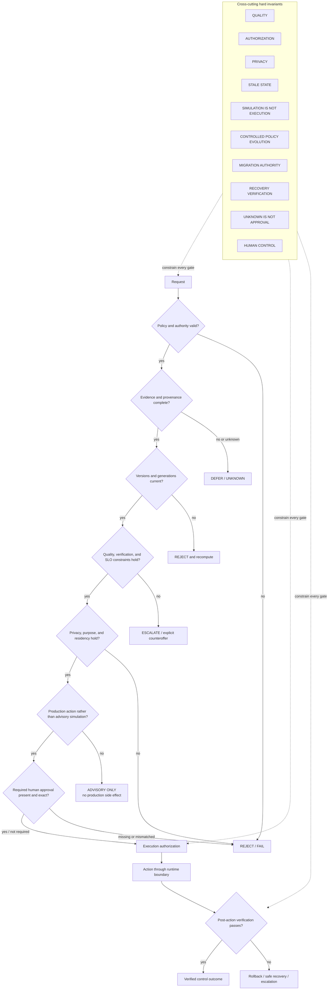

# MERCURY X Safety Control Plane

## Purpose

This diagram shows how hard safety invariants surround an action. A failed hard gate cannot fall through to execution.

## Explanation

The pipeline distinguishes hard rejection from temporary deferral and human escalation. Quality cannot be silently lowered to make a request fit. Simulation cannot cross into action. Migration and recovery remain constrained by the original authority and require verification. Policy evolution is evaluated in controlled states and cannot autonomously promote itself into production.

## Implementation and Runtime Boundary

The safety control plane is represented by repository contracts, validators, lifecycle engines, tests, and internal certification gates. It is not a claim of external regulatory certification, a complete production threat model, or hardware-backed enforcement.

